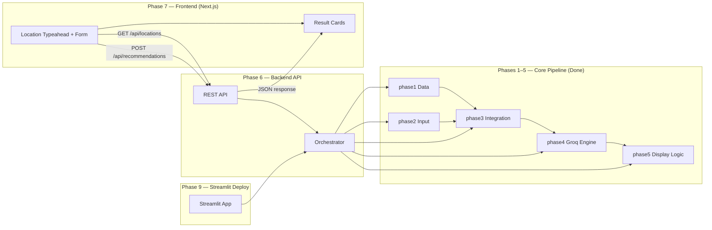

# Phase-Wise Architecture: Zomato Recommendation System

This document breaks the system described in [problemstatement.md](./problemstatement.md) into implementable phases, with clear boundaries, deliverables, and dependencies.

---

## High-Level Architecture

Phases **1–5** implement the **core recommendation pipeline** (data → input → integration → LLM → display logic).  
Phases **6–7** split the app into a **backend API** and a **Next.js frontend**.  
Phase **9** adds a **Streamlit** app for free one-click cloud deployment (optional path alongside Next.js).



**Design principle:** Phases 1–5 are **importable Python modules** with no UI. Phase 6 exposes them over HTTP. Phase 7 is a **Next.js** UI that talks only to Phase 6. Phase 9 wraps the same orchestrator in **Streamlit** for free hosting on Streamlit Community Cloud.

---

## Phase Overview

| Phase | Name | Layer | Goal | Status |
|---|---|---|---|---|
| 1 | Data Layer | Core | Load, clean, and store restaurant data | **Done** |
| 2 | User Input | Core | Validate & model user preferences | **Done** |
| 3 | Integration Layer | Core | Filter data and build LLM prompts | **Done** |
| 4 | Recommendation Engine | Core | Rank restaurants via Groq LLM | **Done** |
| 5 | Display Logic | Core | Parse & format recommendation output | **Done** |
| 6 | Backend API | **Backend** | REST API orchestrating phases 1–5 | **Done** |
| 7 | Frontend UI | **Frontend** | Next.js UI consuming the backend API | **Done** |
| 8 | Enhancements | Both | NL input, follow-ups, caching, polish | **Done** |
| 9 | Streamlit Deployment | **Deploy** | Free Streamlit app + Community Cloud hosting | **Done** |

### Phase grouping

```
┌─────────────────────────────────────────┐
│  CORE (Phases 1–5) — Python modules     │
│  No HTTP, no HTML — testable in isolation│
└─────────────────────────────────────────┘
                    ▲
                    │ imported by
        ┌───────────┴───────────┐
        │                       │
┌───────┴────────┐    ┌─────────┴──────────┐
│ Phase 6 API    │    │ Phase 9 Streamlit  │
└───────┬────────┘    └─────────┬──────────┘
        │ HTTP                  │ free cloud
        ▼                       ▼
┌────────────────┐    ┌────────────────────┐
│ Phase 7 Next.js│    │ Streamlit Cloud    │
└────────────────┘    └────────────────────┘
```

---

## Phase 1 — Data Layer

**Goal:** Ingest the Zomato dataset and make it queryable for downstream filtering.

### Components

| Component | Responsibility |
|---|---|
| **Data Loader** | Fetch dataset from Hugging Face (`ManikaSaini/zomato-restaurant-recommendation`) |
| **Preprocessor** | Normalize fields, handle missing values, standardize formats |
| **Restaurant Store** | In-memory DataFrame, CSV cache, or lightweight DB for fast lookups |

### Data Model

Each restaurant record should expose at minimum:

```
Restaurant {
  name: string
  location: string        // city (e.g. Bangalore)
  locality: string        // area within city (e.g. Marathahalli, Indiranagar)
  cuisine: string[]       // one or more cuisine types
  cost_for_two: number    // approximate cost
  rating: float
  votes: int              // optional
  restaurant_type: string  // optional — casual dining, cafe, etc.
}
```

### Store query interface

| Method | Behavior |
|---|---|
| `get_by_city(city)` | Match normalized city name / aliases |
| `localities(city)` | Sorted unique locality names for a city |
| `get_by_location(query)` | Resolve as city first; else exact/substring locality match |

### Preprocessing Tasks

- Normalize city names (e.g., `Bangalore` vs `Bengaluru`)
- Preserve locality separately from city for area-level filtering
- Parse cuisine strings into a consistent list
- Convert cost and rating to numeric types
- Drop or impute rows with critical missing fields (name, location, rating)

### Deliverables

- [x] Script/module to download and load the dataset
- [x] Cleaned dataset with standardized schema
- [x] Basic data validation (row count, null checks, sample output)
- [x] City and locality query helpers on `RestaurantStore`

### Exit Criteria

> Given a city or Bangalore locality name, the system can return matching restaurants from the cleaned store.

---

## Phase 2 — User Input

**Goal:** Define and validate structured user preferences. **No UI in this phase** — the web form lives in Phase 7.

### Components

| Component | Responsibility |
|---|---|
| **Preference Model** | Typed schema for all user inputs |
| **Validator** | Enforce required fields and valid ranges; return field-level errors |

### Preference Schema

```
UserPreferences {
  location: string              // required — city OR Bangalore locality
  budget: "low" | "medium" | "high" | "custom"  // required
  max_budget: number | null     // required when budget is "custom" (cost for two ceiling)
  cuisine: string               // optional — UI label: Cravings
  min_rating: float             // optional, default 0
  additional_notes: string      // optional — UI label: Required service
}
```

### Budget Mapping (example)

| Budget | Cost for Two Range |
|---|---|
| Low | Rs.0 – Rs.500 |
| Medium | Rs.501 – Rs.1,500 |
| High | Rs.1,501+ |
| Custom | `cost_for_two <= max_budget` (user-entered amount) |

### Deliverables

- [x] `UserPreferences` schema and `parse_preferences()` validator
- [x] Unit tests for edge cases (invalid city, rating out of range)
- [x] *(transitional)* Standalone form demo in `phase2/app.py` — will move to Phase 7

### Exit Criteria

> Given raw preference input (dict/JSON), the module returns a validated `UserPreferences` object or structured field errors.

---

## Phase 3 — Integration Layer

**Goal:** Bridge structured data and the LLM by filtering candidates and building an effective prompt.

### Components

| Component | Responsibility |
|---|---|
| **Filter Engine** | Apply hard filters on location, budget, cuisine, rating |
| **Candidate Formatter** | Convert filtered rows into a compact JSON/text block |
| **Prompt Builder** | Assemble system + user prompt with preferences and candidates |

### Filter Pipeline

```
All Restaurants
  → resolve location via get_by_location()
       (city match first, else Bangalore locality)
  → filter by budget range
  → filter by cuisine (if provided)
  → filter by min_rating
  → sort by rating (desc) / votes
  → take top N candidates (e.g., 15–20)
  → optionally relax rating → cuisine → budget if empty
```

### Prompt Design Principles

1. **Ground the LLM** — Include only filtered candidates; instruct the model not to invent restaurants
2. **State preferences explicitly** — Repeat user inputs in the prompt
3. **Request structured output** — Ask for JSON with rank, name, and explanation fields
4. **Limit token usage** — Send compact candidate summaries, not full raw rows

### Sample Prompt Structure

```
System: You are a restaurant recommendation assistant. Only recommend
        from the provided list. Do not fabricate restaurants.

User:   Preferences: {location, budget, cuisine, min_rating, notes}
        Candidates: [{name, location, cuisine, cost, rating}, ...]
        Task: Rank the top 5 matches and explain why each fits.
        Return JSON: [{rank, name, explanation}, ...]
```

### Deliverables

- [x] Filter engine with configurable thresholds
- [x] Candidate formatter (JSON or markdown table)
- [x] Prompt template with versioning
- [x] Fallback when zero candidates match (suggest relaxing filters)

### Exit Criteria

> Given valid preferences, the integration layer produces a prompt containing 1–20 real restaurant candidates and zero hallucination risk.

---

## Phase 4 — Recommendation Engine

**Goal:** Use the LLM to rank filtered restaurants and generate personalized explanations.

### Components

| Component | Responsibility |
|---|---|
| **LLM Client** | Groq wrapper (`phase4/llm_client.py`) via `GROQ_API_KEY` |
| **Rank & Explain** | Send prompt, parse response, validate against candidate list |
| **Response Guard** | Reject LLM output that references restaurants not in the candidate set |

### Flow

```
Prompt (from Phase 3)
  → LLM API call
  → Parse structured response
  → Validate names against candidate list
  → Attach full restaurant metadata to each ranked item
  → Return RecommendationResult[]
```

### Recommendation Result Schema

```
RecommendationResult {
  rank: int
  name: string
  location: string
  cuisine: string
  cost_for_two: number
  rating: float
  explanation: string    // LLM-generated
}
```

### Error Handling

| Scenario | Handling |
|---|---|
| LLM timeout / API error | Retry once; fall back to rating-based sort with template explanations |
| Invalid JSON response | Re-prompt with stricter format instructions |
| Hallucinated restaurant | Strip from results; log warning |
| Empty candidate list | Return user-facing message to broaden search |

### Deliverables

- [x] LLM client module with API key from environment variable (Groq)
- [x] Response parser (JSON extraction)
- [x] Hallucination guard
- [x] Optional summary paragraph for top picks

### Exit Criteria

> The engine returns a ranked list of 3–5 restaurants, each with metadata and an LLM explanation grounded in the dataset.

---

## Phase 5 — Display Logic

**Goal:** Normalize recommendation responses into a consistent display format. **No HTTP or HTML pages** — rendering utilities only.

### Components

| Component | Responsibility |
|---|---|
| **Response Parser** | Normalize `RecommendationResponse` → `DisplayPayload` |
| **Text Renderer** | CLI-friendly formatted output |
| **JSON Renderer** | API-ready JSON (used by Phase 6) |
| **HTML Renderer** | HTML fragment builder (used by Phase 7) |

### Display Format (per restaurant)

```
#1  Spice Garden
    Bangalore  |  North Indian  |  Rs.800  |  Rating 4.5
    Why: Great match for your medium budget and preference for
         family-friendly North Indian dining with high ratings.
```

### Deliverables

- [x] `parse_response()` — normalize cost/rating labels, handle missing fields
- [x] `render_text()`, `render_json()`, `render_html()` renderers
- [x] Empty-state and error-state payload support
- [x] CLI demo (`phase5/demo.py`)

### Exit Criteria

> Given a `RecommendationResponse`, Phase 5 produces a `DisplayPayload` and can render it as text, JSON, or HTML — without any web server.

---

## Phase 6 — Backend API

**Goal:** Expose the core pipeline (phases 1–5) as a **JSON-only REST API**. No HTML templates.

### Components

| Component | Responsibility |
|---|---|
| **Flask App** | HTTP server, CORS for frontend |
| **Search Orchestrator** | Wires phase1 → phase2 → phase3 → phase4 → phase5; caches restaurant store |
| **API Routes** | `GET /api/health`, `GET /api/locations`, `POST /api/recommendations` |
| **Error Handler** | Maps validation and pipeline errors to HTTP status codes |

### Folder structure

```
phase6/
├── app.py              # create_app(), CORS, routes
├── orchestrator.py     # run_recommendation_search(), store cache
├── schemas.py          # API request/response models
├── validate.py         # Phase 6 validation script
├── requirements.txt
└── tests/
```

### API Contract

#### `GET /api/health`

```json
{ "status": "ok" }
```

#### `GET /api/locations`

Returns Bangalore locality names for the frontend typeahead.

**Query params:**

| Param | Default | Purpose |
|---|---|---|
| `city` | `Bangalore` | Scope localities to a city |
| `q` | _(empty)_ | Optional case-insensitive substring filter |

**Success (200):**
```json
{
  "ok": true,
  "city": "Bangalore",
  "locations": ["Banashankari", "Indiranagar", "Marathahalli", "..."]
}
```

#### `POST /api/recommendations`

**Request:**
```json
{
  "location": "Marathahalli",
  "budget": "custom",
  "max_budget": 2000,
  "cuisine": "Italian",
  "min_rating": 4.0,
  "additional_notes": "outdoor seating"
}
```

`location` may be a city (`Bangalore`) or a Bangalore locality (`Marathahalli`, `HSR`, etc.).  
`budget` may be `low` / `medium` / `high`, or `custom` with `max_budget` (Rs. ceiling for cost for two).

**Success (200):**
```json
{
  "ok": true,
  "display": {
    "title": "Your Recommendations",
    "summary": "Top recommendations for you: ...",
    "recommendations": [
      {
        "rank": 1,
        "name": "The Black Pearl",
        "location": "Bangalore",
        "cuisine": "North Indian, European, BBQ",
        "cost_label": "Rs.1500",
        "rating_label": "4.8",
        "explanation": "High rating, within budget...",
        "source": "llm"
      }
    ]
  }
}
```

**Validation error (400):**
```json
{
  "ok": false,
  "errors": { "location": "Location is required." }
}
```

### Orchestrator flow

```
POST /api/recommendations
  → phase2.parse_preferences()
  → phase1.build_store()              # cached after first load
  → phase3.build_integration()        # get_by_location (city or locality)
  → phase4.build_recommendations()    # Groq
  → phase5.build_display_payload()
  → return JSON
```

### Configuration

| Variable | Purpose |
|---|---|
| `GROQ_API_KEY` | Groq LLM authentication |
| `API_PORT` | Backend port (default `8000`) |
| `CORS_ORIGIN` | Frontend URL (default `http://localhost:3000`) |

### Deliverables

- [x] `phase6/app.py` with health, locations, and recommendations routes
- [x] `orchestrator.py` importing phases 1–5 only
- [x] CORS enabled for Phase 7 frontend
- [x] Unit tests with mocked Groq client
- [x] `python -m phase6.validate` script

### Exit Criteria

> Backend runs independently on port 8000. `curl POST /api/recommendations` returns JSON recommendations without any HTML. `GET /api/locations` returns Bangalore localities.

---

## Phase 7 — Frontend UI

**Goal:** Build a **Next.js** web UI that calls the Phase 6 backend API. No Python pipeline logic in this phase.

### Branding & design

- Product name: **Culinary Compass**
- Stack: Next.js App Router, React, TypeScript, Tailwind CSS
- Visual reference: `screens/screen.png` / `stitch-frontend-prompt.md`
- Serif headings (Playfair Display) + sans body (Inter); brand red `#E23744`

### Components

| Component | Responsibility |
|---|---|
| **Header** | Logo, nav links, Sign In |
| **Search Form** | Preferences card with location typeahead, budget, cuisine, rating, notes |
| **Location Autocomplete** | Loads Bangalore localities from `GET /api/locations`; filters as user types |
| **API Client** | `fetchRecommendations()`, `fetchLocations()` |
| **Result Cards** | Two-column grid with rank badge, rating, cuisine tags, AI Match box |
| **Error Display** | Inline field errors, network banner, empty state |
| **Loading State** | Skeleton cards while backend processes |

### Folder structure

```
phase7/
├── src/
│   ├── app/                # layout.tsx, page.tsx, globals.css
│   ├── components/
│   │   ├── Header.tsx
│   │   ├── SearchForm.tsx
│   │   ├── LocationAutocomplete.tsx
│   │   ├── RecommendationCard.tsx
│   │   ├── ResultsPanel.tsx
│   │   ├── ResultsSkeleton.tsx
│   │   └── ...
│   └── lib/
│       ├── api.ts          # Phase 6 client
│       └── types.ts        # prefs + display types
├── public/images/          # food background asset
├── package.json
├── .env.example            # NEXT_PUBLIC_API_BASE_URL
├── validate.py
└── README.md
```

### UI form fields

| Field | Control | Required |
|---|---|---|
| Location | Typeahead of Bangalore localities (filter by typed letters) | Yes |
| Budget | Select: Rs. 0–500 / 500–1,500 / 1,501+ / **Enter custom amount**; custom shows a number input | Yes |
| Cravings | Text input (API field: `cuisine`) | No |
| Minimum rating | Placeholder `e.g. 4.0+` (muted); options Any + **2.5+ → 5.0+** step **0.5** | No |
| Required service | Textarea (API field: `additional_notes`) | No |

Placeholder / example text on Budget and Minimum rating selects uses muted gray (`text-gray-400`) to match other field placeholders.

### Frontend flow

```
Page load → GET /api/locations?city=Bangalore
        │
        ▼
User types location → client filters localities by alphabet/prefix
User selects locality + other prefs → submit
        │
        ▼  fetch POST http://localhost:8000/api/recommendations
Phase 6 Backend returns JSON
        │
        ▼
React renders result cards, summary, errors
```

### Deliverables

- [x] Next.js Culinary Compass UI
- [x] Calls Phase 6 API (`NEXT_PUBLIC_API_BASE_URL`)
- [x] Bangalore locality typeahead
- [x] Rating dropdown with muted placeholder and 2.5–5.0 steps
- [x] Custom budget amount option
- [x] Cravings + Required service labels
- [x] Loading skeleton, error, and empty-state UI
- [x] `npm run dev` on port 3000

### Exit Criteria

> With Phase 6 running, user opens the frontend, picks a Bangalore locality from the typeahead, submits preferences, and sees recommendation cards — frontend contains zero backend/Python logic.

### How to run

```powershell
# Terminal 1 — Backend
python -m phase6.validate --serve

# Terminal 2 — Frontend
cd phase7
npm install
npm run dev
```

Open **http://localhost:3000**

---

## Phase 8 — Enhancements

**Goal:** Improve usability and intelligence beyond the MVP full-stack.

### 8a — Natural Language Input

- Parse free-text queries into `UserPreferences` using the LLM
- Example: *"Cheap Italian in Bangalore, 4+ stars"* → structured prefs
- API: `POST /api/parse-preferences` `{ "query": "..." }`
- Module: `phase8/nl_parser.py`

### 8b — Follow-Up / Refinement

- Maintain session context for multi-turn conversations (`phase8/session.py`)
- Allow: *"Show me cheaper options"* or *"Only outdoor seating"*
- API: `POST /api/refine` `{ "session_id", "follow_up" }`
- Heuristic fallbacks for common phrases when useful

### 8c — Caching & Persistence

- Cache recent searches and LLM display payloads (`phase8/cache.py`)
- Store search history (in-memory + optional JSON under `phase8/cache/`)
- Recommendations responses include `session_id` and `cache_hit`
- API: `GET /api/history`

### 8d — UI Polish

- Phase 7: NL search box, follow-up bar, recent searches (localStorage)
- Fade-in animations on cards / panels
- Mobile-friendly stacked controls

### Folder structure

```
phase8/
├── nl_parser.py
├── refinement.py
├── session.py
├── cache.py
├── pipeline.py
├── validate.py
├── requirements.txt
└── tests/
```

### Deliverables

- [x] NL preference parsing via Groq
- [x] Session + follow-up refinement
- [x] Search cache and history
- [x] Phase 6 routes: parse-preferences, refine, history
- [x] Phase 7 NL / follow-up / history UI
- [x] Unit tests + `python -m phase8.validate`

### Exit Criteria

> User can paste a natural-language query to fill the form, refine results with follow-ups, and repeat recent searches faster via cache/history.

---

## Phase 9 — Streamlit Deployment

**Goal:** Ship a **free, shareable** Culinary Compass demo using **Streamlit**, without hosting a separate Next.js frontend or Flask server. The Streamlit app imports the Phase 6 orchestrator (phases 1–5) directly and deploys to **Streamlit Community Cloud**.

### Why Streamlit for free deploy

| Benefit | Detail |
|---|---|
| **$0 hosting** | [Streamlit Community Cloud](https://streamlit.io/cloud) from a public GitHub repo |
| **One Python process** | UI + pipeline in one app — no CORS / Vercel / Render wiring |
| **Secrets UI** | `GROQ_API_KEY` set in the Cloud dashboard (not committed) |
| **Fast share link** | Public URL for demos and portfolio |

Phase 6 + 7 remain the primary full-stack path. Phase 9 is the **lightweight free-deploy alternative**.

### Components

| Component | Responsibility |
|---|---|
| **Streamlit UI** | Form: location, budget (incl. custom), cravings, min rating, required service |
| **Locality selector** | Dropdown / selectbox of Bangalore localities from `RestaurantStore.localities()` |
| **Orchestrator bridge** | Calls `phase6.orchestrator.run_recommendation_search()` |
| **Results view** | Ranked cards with rating, cost, cuisine tags, AI Match explanation |
| **Cloud config** | `requirements` + secrets for Community Cloud |

### Folder structure (to implement)

```
phase9/
├── app.py                 # streamlit run entrypoint
├── ui.py                  # form widgets + result rendering helpers
├── requirements.txt       # streamlit + project deps
├── .streamlit/
│   └── config.toml        # theme (optional brand red)
├── validate.py            # smoke test / local run helper
└── README.md              # local + Community Cloud deploy steps
```

### App flow

```
User opens Streamlit URL
        │
        ▼
[phase9] Load store (cached) → locality list for Bangalore
[phase9] User fills preferences → Submit
        │
        ▼
run_recommendation_search(prefs)   # Phase 6 orchestrator
  → phase2 → phase1 → phase3 → phase4 (Groq) → phase5
        │
        ▼
[phase9] Render recommendation cards + messages / errors
```

### Form fields (aligned with Phase 7)

| Field | Streamlit control | Required |
|---|---|---|
| Location | `st.selectbox` / searchable select of Bangalore localities | Yes |
| Budget | `st.selectbox` (low / medium / high / custom) + number input for custom | Yes |
| Cravings | `st.text_input` | No |
| Minimum rating | `st.selectbox` (Any, 2.5+ … 5.0+ step 0.5) | No |
| Required service | `st.text_area` | No |

### Configuration / secrets

| Name | Where | Purpose |
|---|---|---|
| `GROQ_API_KEY` | Streamlit Cloud **Secrets** or local `.streamlit/secrets.toml` | Groq LLM |
| Dataset cache | `phase1/cache/zomato_raw.csv` in repo **or** download on first run | Restaurant data |

Example `secrets.toml` (local only — never commit):

```toml
GROQ_API_KEY = "your_groq_api_key_here"
```

### Local run

```powershell
cd zomato
pip install -r phase9/requirements.txt
streamlit run phase9/app.py
```

Open **http://localhost:8501**

### Free deploy — Streamlit Community Cloud

1. Push `phase9/` (and core phases) to the public GitHub repo.
2. Go to [share.streamlit.io](https://share.streamlit.io) → **New app**.
3. Select repo, branch, and **Main file path:** `zomato/phase9/app.py`.
4. Add secret: `GROQ_API_KEY`.
5. Deploy → share the public `*.streamlit.app` URL.

### Deliverables

- [x] `phase9/app.py` Streamlit UI calling `run_recommendation_search()`
- [x] Locality + budget/custom + cravings + rating + required service controls
- [x] Result cards matching Phase 5 display payload fields
- [x] `phase9/requirements.txt` and deploy README
- [x] Documented Community Cloud steps (secrets, main file path)
- [x] `python -m phase9.validate` smoke test

### Exit Criteria

> App runs locally via `streamlit run phase9/app.py` and deploys to Streamlit Community Cloud with only `GROQ_API_KEY` as a secret — users can search and see recommendations from a public URL at no hosting cost.

---

## Project Structure

```
zomato/
├── phase1/                     # CORE — Data layer (Done)
│   ├── loader.py
│   ├── preprocessor.py
│   ├── store.py                # cities(), localities(), get_by_location()
│   ├── pipeline.py
│   └── tests/
│
├── phase2/                     # CORE — Input validation (Done)
│   ├── preferences.py
│   └── tests/
│
├── phase3/                     # CORE — Integration layer (Done)
│   ├── filter.py               # city OR locality via get_by_location()
│   ├── formatter.py
│   ├── prompts.py
│   ├── pipeline.py
│   └── tests/
│
├── phase4/                     # CORE — Groq recommendation engine (Done)
│   ├── llm_client.py
│   ├── recommender.py
│   ├── guard.py
│   ├── fallback.py
│   ├── pipeline.py
│   └── tests/
│
├── phase5/                     # CORE — Display logic (Done)
│   ├── parser.py
│   ├── renderer.py
│   ├── pipeline.py
│   ├── demo.py
│   └── tests/
│
├── phase6/                     # BACKEND — REST API (Done)
│   ├── app.py                  # /api/health, /api/locations, /api/recommendations
│   ├── orchestrator.py
│   ├── schemas.py
│   └── tests/
│
├── phase7/                     # FRONTEND — Next.js UI (Done)
│   ├── src/
│   │   ├── app/
│   │   ├── components/         # Header, SearchForm, LocationAutocomplete, cards
│   │   └── lib/                # api.ts, types.ts
│   ├── public/images/
│   ├── package.json
│   └── README.md
│
├── phase8/                     # ENHANCEMENTS — NL, refine, cache (Done)
│   ├── nl_parser.py
│   ├── refinement.py
│   ├── session.py
│   ├── cache.py
│   ├── pipeline.py
│   └── tests/
│
├── phase9/                     # DEPLOY — Streamlit app (Done)
│   ├── app.py                  # streamlit run entrypoint
│   ├── ui.py
│   ├── requirements.txt
│   ├── .streamlit/config.toml
│   └── README.md
│
├── screens/                    # UI design reference (screen.png)
├── stitch-frontend-prompt.md
├── requirements.txt
├── .env.example
├── problemstatement.md
├── architecture.md
└── edge-cases.md
```

### Legacy demos

`phase2/app.py` and `phase5/app.py` remain as earlier monolithic demos.  
**Primary split:** Phase 6 API + Phase 7 Next.js.  
**Free deploy path:** Phase 9 Streamlit → Community Cloud.

---

## End-to-End Request Flow

```
User opens http://localhost:3000          (Phase 7 — Next.js)
        │
        ├─► GET /api/locations            (load Bangalore localities)
        │
        ▼
[phase7] User types location → typeahead filters by alphabet
[phase7] User submits preferences
        │
        ▼  POST /api/recommendations
[phase6] Backend API receives JSON
        │
        ├─► [phase2] parse_preferences()
        ├─► [phase1] build_store() / get_by_location()
        ├─► [phase3] build_integration()
        ├─► [phase4] build_recommendations()  (Groq)
        └─► [phase5] build_display_payload()
        │
        ▼  JSON response
[phase7] React renders Culinary Compass result cards + AI Match text
```

---

## Implementation Status

| Phase | Layer | Status | Entry point |
|---|---|---|---|
| 1 | Core | **Done** | `python -m phase1.validate` |
| 2 | Core | **Done** | `python -m phase2.validate` |
| 3 | Core | **Done** | `python -m phase3.validate` |
| 4 | Core | **Done** | `python -m phase4.validate --live` |
| 5 | Core | **Done** | `python phase5/demo.py --live` |
| 6 | Backend | **Done** | `python -m phase6.validate --serve` |
| 7 | Frontend | **Done** | `cd phase7; npm run dev` |
| 8 | Both | **Done** | `python -m phase8.validate` |
| 9 | Deploy | **Done** | `streamlit run phase9/app.py` |

### Recent UI / filter updates

1. **Bangalore locality typeahead** — Phase 7 loads localities from `GET /api/locations` and filters as the user types
2. **Location resolution** — Phase 1/3 match city or locality via `get_by_location()`
3. **Minimum rating dropdown** — muted placeholder `e.g. 4.0+`; options Any + **2.5+ to 5.0+** in **0.5** steps
4. **Budget** — presets plus **custom** amount (`max_budget`); muted placeholder `e.g. Rs. 500 - 1,500`
5. **Cravings** — UI label for cuisine preference
6. **Required service** — UI label for free-text service needs (`additional_notes`)
7. **Culinary Compass Next.js UI** — branded layout with two-column recommendation cards
8. **Streamlit deployment (Phase 9)** — free Community Cloud path wrapping the Phase 6 orchestrator

### Manual test run

```powershell
# Terminal 1 — Backend
cd zomato
python -m phase6.validate --serve

# Terminal 2 — Frontend
cd zomato/phase7
npm run dev
```

Open **http://localhost:3000**.

### Streamlit free deploy (after Phase 9 is implemented)

```powershell
cd zomato
streamlit run phase9/app.py
```

Then deploy from GitHub via [Streamlit Community Cloud](https://share.streamlit.io) with main file `zomato/phase9/app.py` and secret `GROQ_API_KEY`.
