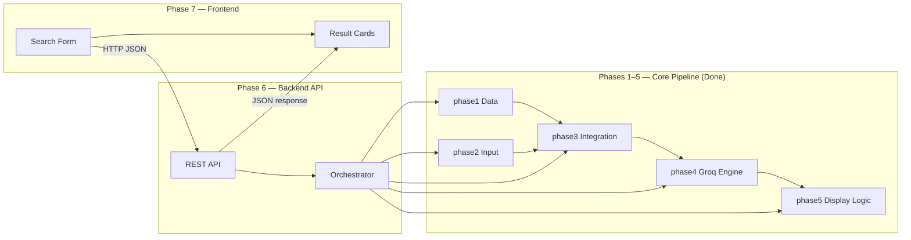

# Phase-Wise Architecture: Zomato Recommendation System

This document breaks the system described in [problemstatement.md](./problemstatement.md) into implementable phases, with clear boundaries, deliverables, and dependencies.

---

## High-Level Architecture

Phases **1–5** implement the **core recommendation pipeline** (data → input → integration → LLM → display logic).  
Phases **6–7** split the app into a **backend API** and a **frontend UI** for easier, independent implementation.



**Design principle:** Phases 1–5 are **importable Python modules** with no UI. Phase 6 exposes them over HTTP. Phase 7 is UI-only and talks to Phase 6.

---

## Phase Overview

| Phase | Name | Layer | Goal | Status |
|---|---|---|---|---|
| 1 | Data Layer | Core | Load, clean, and store restaurant data | **Done** |
| 2 | User Input | Core | Validate & model user preferences | **Done** |
| 3 | Integration Layer | Core | Filter data and build LLM prompts | **Done** |
| 4 | Recommendation Engine | Core | Rank restaurants via Groq LLM | **Done** |
| 5 | Display Logic | Core | Parse & format recommendation output | **Done** |
| 6 | Backend API | **Backend** | REST API orchestrating phases 1–5 | **Next** |
| 7 | Frontend UI | **Frontend** | Web UI consuming the backend API | **Next** |
| 8 | Enhancements *(optional)* | Both | NL input, follow-ups, caching, polish | Planned |

### Phase grouping

```
┌─────────────────────────────────────────┐
│  CORE (Phases 1–5) — Python modules     │
│  No HTTP, no HTML — testable in isolation│
└─────────────────────────────────────────┘
                    ▲
                    │ imported by
┌───────────────────┴─────────────────────┐
│  Phase 6 — Backend API (JSON only)      │
└───────────────────┬─────────────────────┘
                    │ HTTP
                    ▼
┌─────────────────────────────────────────┐
│  Phase 7 — Frontend (HTML/CSS/JS)       │
└─────────────────────────────────────────┘
```

---

## Phase 1 — Data Layer

**Goal:** Ingest the Zomato dataset and make it queryable for downstream filtering.

### Components

| Component | Responsibility |
|---|---|
| **Data Loader** | Fetch dataset from Hugging Face (`ManikaSaini/zomato-restaurant-recommendation`) |
| **Preprocessor** | Normalize fields, handle missing values, standardize formats |
| **Restaurant Store** | In-memory DataFrame, CSV cache, or lightweight DB for fast lookups |

### Data Model

Each restaurant record should expose at minimum:

```
Restaurant {
  name: string
  location: string        // city / locality
  cuisine: string[]       // one or more cuisine types
  cost_for_two: number    // approximate cost
  rating: float
  votes: int              // optional
  restaurant_type: string  // optional — casual dining, cafe, etc.
}
```

### Preprocessing Tasks

- Normalize city names (e.g., `Bangalore` vs `Bengaluru`)
- Parse cuisine strings into a consistent list
- Convert cost and rating to numeric types
- Drop or impute rows with critical missing fields (name, location, rating)

### Deliverables

- [x] Script/module to download and load the dataset
- [x] Cleaned dataset with standardized schema
- [x] Basic data validation (row count, null checks, sample output)

### Exit Criteria

> Given a city name, the system can return all restaurants in that city from the cleaned store.

---

## Phase 2 — User Input

**Goal:** Define and validate structured user preferences. **No UI in this phase** — the web form lives in Phase 7.

### Components

| Component | Responsibility |
|---|---|
| **Preference Model** | Typed schema for all user inputs |
| **Validator** | Enforce required fields and valid ranges; return field-level errors |

### Preference Schema

```
UserPreferences {
  location: string              // required
  budget: "low" | "medium" | "high"  // required
  cuisine: string               // optional
  min_rating: float             // optional, default 0
  additional_notes: string      // optional — free text
}
```

### Budget Mapping (example)

| Budget | Cost for Two Range |
|---|---|
| Low | ₹0 – ₹500 |
| Medium | ₹501 – ₹1,500 |
| High | ₹1,501+ |

### Deliverables

- [x] `UserPreferences` schema and `parse_preferences()` validator
- [x] Unit tests for edge cases (invalid city, rating out of range)
- [x] *(transitional)* Standalone form demo in `phase2/app.py` — will move to Phase 7

### Exit Criteria

> Given raw preference input (dict/JSON), the module returns a validated `UserPreferences` object or structured field errors.

---

## Phase 3 — Integration Layer

**Goal:** Bridge structured data and the LLM by filtering candidates and building an effective prompt.

### Components

| Component | Responsibility |
|---|---|
| **Filter Engine** | Apply hard filters on location, budget, cuisine, rating |
| **Candidate Formatter** | Convert filtered rows into a compact JSON/text block |
| **Prompt Builder** | Assemble system + user prompt with preferences and candidates |

### Filter Pipeline

```
All Restaurants
  → filter by location
  → filter by budget range
  → filter by cuisine (if provided)
  → filter by min_rating
  → sort by rating (desc) / votes
  → take top N candidates (e.g., 15–20)
```

### Prompt Design Principles

1. **Ground the LLM** — Include only filtered candidates; instruct the model not to invent restaurants
2. **State preferences explicitly** — Repeat user inputs in the prompt
3. **Request structured output** — Ask for JSON with rank, name, and explanation fields
4. **Limit token usage** — Send compact candidate summaries, not full raw rows

### Sample Prompt Structure

```
System: You are a restaurant recommendation assistant. Only recommend
        from the provided list. Do not fabricate restaurants.

User:   Preferences: {location, budget, cuisine, min_rating, notes}
        Candidates: [{name, location, cuisine, cost, rating}, ...]
        Task: Rank the top 5 matches and explain why each fits.
        Return JSON: [{rank, name, explanation}, ...]
```

### Deliverables

- [x] Filter engine with configurable thresholds
- [x] Candidate formatter (JSON or markdown table)
- [x] Prompt template with versioning
- [x] Fallback when zero candidates match (suggest relaxing filters)

### Exit Criteria

> Given valid preferences, the integration layer produces a prompt containing 1–20 real restaurant candidates and zero hallucination risk.

---

## Phase 4 — Recommendation Engine

**Goal:** Use the LLM to rank filtered restaurants and generate personalized explanations.

### Components

| Component | Responsibility |
|---|---|
| **LLM Client** | Groq wrapper (`phase4/llm_client.py`) via `GROQ_API_KEY` |
| **Rank & Explain** | Send prompt, parse response, validate against candidate list |
| **Response Guard** | Reject LLM output that references restaurants not in the candidate set |

### Flow

```
Prompt (from Phase 3)
  → LLM API call
  → Parse structured response
  → Validate names against candidate list
  → Attach full restaurant metadata to each ranked item
  → Return RecommendationResult[]
```

### Recommendation Result Schema

```
RecommendationResult {
  rank: int
  name: string
  location: string
  cuisine: string
  cost_for_two: number
  rating: float
  explanation: string    // LLM-generated
}
```

### Error Handling

| Scenario | Handling |
|---|---|
| LLM timeout / API error | Retry once; fall back to rating-based sort with template explanations |
| Invalid JSON response | Re-prompt with stricter format instructions |
| Hallucinated restaurant | Strip from results; log warning |
| Empty candidate list | Return user-facing message to broaden search |

### Deliverables

- [x] LLM client module with API key from environment variable (Groq)
- [x] Response parser (JSON extraction)
- [x] Hallucination guard
- [x] Optional summary paragraph for top picks

### Exit Criteria

> The engine returns a ranked list of 3–5 restaurants, each with metadata and an LLM explanation grounded in the dataset.

---

## Phase 5 — Display Logic

**Goal:** Normalize recommendation responses into a consistent display format. **No HTTP or HTML pages** — rendering utilities only.

### Components

| Component | Responsibility |
|---|---|
| **Response Parser** | Normalize `RecommendationResponse` → `DisplayPayload` |
| **Text Renderer** | CLI-friendly formatted output |
| **JSON Renderer** | API-ready JSON (used by Phase 6) |
| **HTML Renderer** | HTML fragment builder (used by Phase 7) |

### Display Format (per restaurant)

```
#1  Spice Garden
    Bangalore  |  North Indian  |  Rs.800  |  Rating 4.5
    Why: Great match for your medium budget and preference for
         family-friendly North Indian dining with high ratings.
```

### Deliverables

- [x] `parse_response()` — normalize cost/rating labels, handle missing fields
- [x] `render_text()`, `render_json()`, `render_html()` renderers
- [x] Empty-state and error-state payload support
- [x] CLI demo (`phase5/demo.py`)

### Exit Criteria

> Given a `RecommendationResponse`, Phase 5 produces a `DisplayPayload` and can render it as text, JSON, or HTML — without any web server.

---

## Phase 6 — Backend API

**Goal:** Expose the core pipeline (phases 1–5) as a **JSON-only REST API**. No HTML templates.

### Components

| Component | Responsibility |
|---|---|
| **Flask/FastAPI App** | HTTP server, CORS for frontend |
| **Search Orchestrator** | Wires phase1 → phase2 → phase3 → phase4 → phase5 |
| **API Routes** | `POST /api/recommendations`, `GET /api/health` |
| **Error Handler** | Maps validation and pipeline errors to HTTP status codes |

### Folder structure (to implement)

```
phase6/
├── app.py              # create_app(), CORS, routes
├── orchestrator.py     # run_recommendation_search()
├── schemas.py          # API request/response models
├── validate.py         # Phase 6 validation script
├── requirements.txt
└── tests/
```

### API Contract

#### `GET /api/health`

```json
{ "status": "ok" }
```

#### `POST /api/recommendations`

**Request:**
```json
{
  "location": "Marathahalli",
  "budget": "high",
  "cuisine": "Italian",
  "min_rating": 4.0,
  "additional_notes": "family-friendly"
}
```

**Success (200):**
```json
{
  "ok": true,
  "display": {
    "title": "Your Recommendations",
    "summary": "Top recommendations for you: ...",
    "recommendations": [
      {
        "rank": 1,
        "name": "The Black Pearl",
        "location": "Bangalore",
        "cuisine": "North Indian, European, BBQ",
        "cost_label": "Rs.1500",
        "rating_label": "4.8",
        "explanation": "High rating, within budget...",
        "source": "llm"
      }
    ]
  }
}
```

**Validation error (400):**
```json
{
  "ok": false,
  "errors": { "location": "Location is required." }
}
```

### Orchestrator flow

```
POST /api/recommendations
  → phase2.parse_preferences()
  → phase1.build_store()
  → phase3.build_integration()
  → phase4.build_recommendations()   # Groq
  → phase5.build_display_payload()
  → return JSON
```

### Configuration

| Variable | Purpose |
|---|---|
| `GROQ_API_KEY` | Groq LLM authentication |
| `API_PORT` | Backend port (default `8000`) |
| `CORS_ORIGIN` | Frontend URL (default `http://localhost:3000`) |

### Deliverables

- [ ] `phase6/app.py` with health + recommendations routes
- [ ] `orchestrator.py` importing phases 1–5 only
- [ ] CORS enabled for Phase 7 frontend
- [ ] Unit tests with mocked Groq client
- [ ] `python -m phase6.validate` script

### Exit Criteria

> Backend runs independently on port 8000. `curl POST /api/recommendations` returns JSON recommendations without any HTML.

---

## Phase 7 — Frontend UI

**Goal:** Build a **standalone web UI** that calls the Phase 6 backend API. No Python pipeline logic in this phase.

### Components

| Component | Responsibility |
|---|---|
| **Search Form** | Location, budget, cuisine, rating, notes |
| **API Client** | `fetch()` to `POST /api/recommendations` |
| **Result Cards** | Render recommendations from JSON response |
| **Error Display** | Show validation errors and empty states |
| **Loading State** | Spinner while backend processes request |

### Folder structure (to implement)

```
phase7/
├── index.html          # Search form + results container
├── static/
│   ├── style.css       # Layout and card styles
│   └── app.js          # Form submit, API call, DOM rendering
├── validate.py         # Static file / integration smoke test
└── README.md           # How to run with Phase 6 backend
```

### UI form fields

| Field | Control | Required |
|---|---|---|
| Location | Text input | Yes |
| Budget | Select: low / medium / high | Yes |
| Cuisine | Text input | No |
| Minimum rating | Number input (0 – 5) | No |
| Additional notes | Textarea | No |

### Frontend flow

```
User fills form → app.js validates locally (optional)
        │
        ▼  fetch POST http://localhost:8000/api/recommendations
Phase 6 Backend returns JSON
        │
        ▼
app.js renders result cards, summary, errors
```

### Deliverables

- [ ] `index.html` + `style.css` + `app.js`
- [ ] Calls Phase 6 API (configurable `API_BASE_URL`)
- [ ] Loading spinner during API call
- [ ] Error and empty-state UI
- [ ] Works when served via `python -m http.server` or Live Server

### Exit Criteria

> With Phase 6 running, user opens the frontend, submits preferences, and sees recommendation cards — frontend contains zero backend/Python logic.

### How to run (after implementation)

```powershell
# Terminal 1 — Backend
python -m phase6.validate --serve

# Terminal 2 — Frontend
cd phase7
python -m http.server 3000
```

Open **http://localhost:3000**

---

## Phase 8 — Enhancements *(Optional)*

**Goal:** Improve usability and intelligence beyond the MVP full-stack.

### 8a — Natural Language Input

- Parse free-text queries into `UserPreferences` using the LLM
- Example: *"Cheap Italian in Bangalore, 4+ stars"* → structured prefs

### 8b — Follow-Up / Refinement

- Maintain session context for multi-turn conversations
- Allow: *"Show me cheaper options"* or *"Only outdoor seating"*

### 8c — Caching & Persistence

- Cache recent searches and LLM responses in Phase 6
- Store search history for faster repeat queries

### 8d — UI Polish

- Mobile responsiveness, animations, search history in Phase 7
- Optional React/Vue migration for Phase 7

---

## Project Structure

```
zomato/
├── phase1/                     # CORE — Data layer (Done)
│   ├── loader.py
│   ├── preprocessor.py
│   ├── store.py
│   ├── pipeline.py
│   └── tests/
│
├── phase2/                     # CORE — Input validation (Done)
│   ├── preferences.py
│   └── tests/
│
├── phase3/                     # CORE — Integration layer (Done)
│   ├── filter.py
│   ├── formatter.py
│   ├── prompts.py
│   ├── pipeline.py
│   └── tests/
│
├── phase4/                     # CORE — Groq recommendation engine (Done)
│   ├── llm_client.py
│   ├── recommender.py
│   ├── guard.py
│   ├── fallback.py
│   ├── pipeline.py
│   └── tests/
│
├── phase5/                     # CORE — Display logic (Done)
│   ├── parser.py               # parse_response()
│   ├── renderer.py             # text / JSON / HTML renderers
│   ├── pipeline.py             # present()
│   ├── demo.py                 # CLI demo
│   └── tests/
│
├── phase6/                     # BACKEND — REST API (Next)
│   ├── app.py                  # Flask app, CORS, routes
│   ├── orchestrator.py         # Wires phases 1–5
│   ├── schemas.py
│   └── tests/
│
├── phase7/                     # FRONTEND — Web UI (Next)
│   ├── index.html
│   ├── static/
│   │   ├── style.css
│   │   └── app.js              # fetch() → Phase 6 API
│   └── README.md
│
├── requirements.txt
├── .env.example
├── problemstatement.md
├── architecture.md
└── edge-cases.md
```

### Transitional code (to refactor)

The current `phase5/app.py` and `phase2/app.py` are **monolithic demos** that combine backend + frontend. When implementing Phase 6 and 7:

| Current file | Move to |
|---|---|
| `phase5/app.py` orchestration logic | `phase6/orchestrator.py` + `phase6/app.py` |
| `phase5/templates/search.html` | `phase7/index.html` |
| `phase5/static/style.css` | `phase7/static/style.css` |
| Form submit + API call logic | `phase7/static/app.js` |

---

## End-to-End Request Flow

```
User opens http://localhost:3000          (Phase 7 — Frontend)
        │
        ▼
[phase7] User submits preference form
        │
        ▼  fetch POST /api/recommendations
[phase6] Backend API receives JSON
        │
        ├─► [phase2] parse_preferences()
        ├─► [phase1] build_store()
        ├─► [phase3] build_integration()
        ├─► [phase4] build_recommendations()  (Groq)
        └─► [phase5] build_display_payload()
        │
        ▼  JSON response
[phase7] app.js renders result cards + summary
```

---

## Implementation Status

| Phase | Layer | Status | Entry point |
|---|---|---|---|
| 1 | Core | **Done** | `python -m phase1.validate` |
| 2 | Core | **Done** | `python -m phase2.validate` |
| 3 | Core | **Done** | `python -m phase3.validate` |
| 4 | Core | **Done** | `python -m phase4.validate --live` |
| 5 | Core | **Done** | `python phase5/demo.py --live` |
| 6 | Backend | **Next** | `python -m phase6.validate --serve` |
| 7 | Frontend | **Next** | `python -m http.server 3000` (in `phase7/`) |
| 8 | Both | Planned | — |

### Implementation order (Phases 6–7)

1. **Phase 6** — Extract orchestrator from `phase5/app.py` into `phase6/`; expose JSON API only; test with `curl`
2. **Phase 7** — Move HTML/CSS to `phase7/`; add `app.js` calling Phase 6; test full flow in browser
3. **Phase 8** — Add enhancements once backend + frontend run independently

### Current interim demo

Until Phase 6/7 are implemented, the monolithic demo still works:

```powershell
python -m phase5.validate --serve   # combined backend + frontend on port 5000
```

Each core phase (1–5) remains independently testable. Backend and frontend are separate phases for clearer ownership and easier parallel development.
